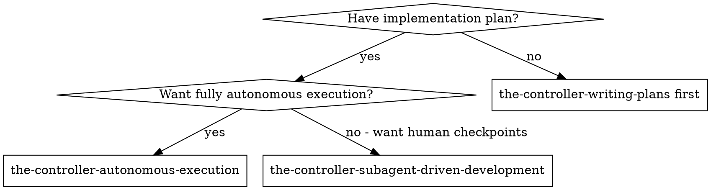
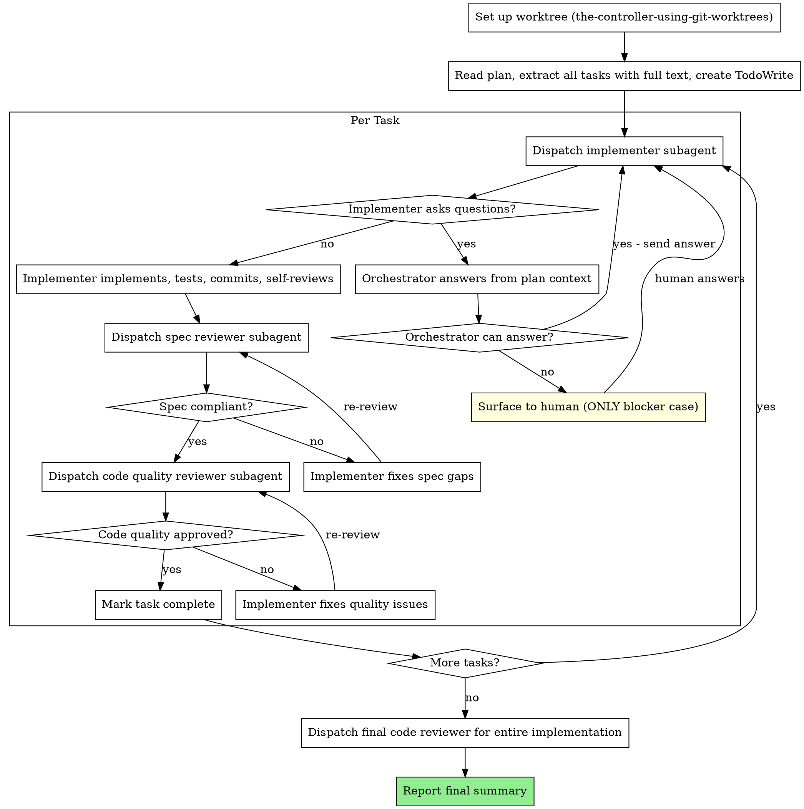

# Autonomous Execution Skill Implementation Plan

> **For Claude:** REQUIRED SUB-SKILL: Use the-controller-executing-plans to implement this plan task-by-task.

**Goal:** Create a skill that executes implementation plans fully autonomously — same quality gates as subagent-driven-development (implementer + spec review + code quality review + final review), but zero human interaction unless genuinely blocked. Includes worktree setup. No merge step.

**Architecture:** Single SKILL.md file that modifies the subagent-driven-development flow in two ways: (1) orchestrator answers subagent questions from plan context instead of surfacing to human, (2) ends with a summary report instead of finishing-a-development-branch. Reuses all prompt templates from subagent-driven-development via cross-reference.

**Tech Stack:** Markdown (skill document), Graphviz DOT (flowcharts)

---

### Task 1: Create the skill directory

**Files:**
- Create: `skills/the-controller-autonomous-execution/` (directory)

**Step 1: Create directory**

Run: `mkdir -p skills/the-controller-autonomous-execution`

---

### Task 2: Write SKILL.md

**Files:**
- Create: `skills/the-controller-autonomous-execution/SKILL.md`

**Step 1: Write the skill file**

Create `skills/the-controller-autonomous-execution/SKILL.md` with the following content:

```markdown
---
name: the-controller-autonomous-execution
description: Use when executing an implementation plan fully autonomously without human interaction, only reporting back when all tasks are complete or when genuinely blocked
---

# Autonomous Execution

Execute an implementation plan end-to-end with zero human interaction. Same quality gates as subagent-driven-development (fresh subagent per task, spec review, code quality review, final review), but the orchestrator handles all decisions autonomously.

**Core principle:** Full subagent-driven-development quality, zero human checkpoints — orchestrator resolves ambiguity from plan context, only surfaces when genuinely blocked.

**Announce at start:** "I'm using the the-controller-autonomous-execution skill to execute this plan autonomously. I'll report back when all tasks are complete."

## When to Use



**vs. subagent-driven-development:**
- Same quality gates (implementer + spec review + code quality review + final review)
- Orchestrator answers subagent questions from plan context (no human in loop)
- Includes worktree setup (no separate step needed)
- No merge at end (human reviews and decides)

**vs. executing-plans:**
- Fresh subagent per task (no context pollution)
- Automated review gates (not human checkpoints)
- Fully autonomous (no "ready for feedback" pauses)

## The Process



## Prompt Templates

Reuse from the-controller-subagent-driven-development:
- Implementer: `the-controller-subagent-driven-development/implementer-prompt.md`
- Spec reviewer: `the-controller-subagent-driven-development/spec-reviewer-prompt.md`
- Code quality reviewer: `the-controller-subagent-driven-development/code-quality-reviewer-prompt.md`

## Orchestrator Question Handling

When an implementer subagent asks a question, the orchestrator MUST attempt to answer it before surfacing to the human:

1. **Check plan text** — Does the plan specify the answer?
2. **Check project context** — Can you determine the answer from codebase, CLAUDE.md, docs?
3. **Make reasonable inference** — Is there an obvious correct answer given the architecture?

**Only surface to human if:** The answer genuinely cannot be determined from available context and guessing wrong would cause significant rework.

**When answering:** Provide the answer clearly, with reasoning, so the implementer can proceed confidently.

## Final Summary Report

After all tasks complete and final review passes, report:

- Tasks completed (N/N)
- Files created/modified (list)
- Test results (all passing)
- Final reviewer assessment
- Worktree location (so human can review)
- Any decisions the orchestrator made on behalf of subagents (with reasoning)

## Red Flags

**Never:**
- Surface to human for questions answerable from plan context
- Skip any review stage (spec compliance OR code quality OR final)
- Proceed with unfixed review issues
- Dispatch multiple implementers in parallel
- Start code quality review before spec compliance passes
- Merge or finish the branch (human decides)
- Make subagent read plan file (provide full text instead)

**Always:**
- Set up worktree first
- Answer subagent questions from plan context when possible
- Run full review cycle per task (same as subagent-driven-development)
- Document decisions made on behalf of subagents
- Report everything at the end

## Integration

**Required workflow skills:**
- **the-controller-using-git-worktrees** — REQUIRED: Set up isolated workspace before starting
- **the-controller-writing-plans** — Creates the plan this skill executes

**Reuses prompts from:**
- **the-controller-subagent-driven-development** — Implementer, spec reviewer, code quality reviewer templates

**Subagents should use:**
- **the-controller-test-driven-development** — Subagents follow TDD for each task

**Does NOT use:**
- **the-controller-finishing-a-development-branch** — Human reviews and merges
```

**Step 2: Verify file was written correctly**

Run: `head -5 skills/the-controller-autonomous-execution/SKILL.md`
Expected: YAML frontmatter with name and description

---

### Task 3: Sync the skill

**REQUIRED SUB-SKILL:** Use the-controller-synchronizing-skills to symlink the new skill so Claude Code and Codex can discover it.

**Step 1: Sync skills**

Follow the the-controller-synchronizing-skills skill to symlink `skills/the-controller-autonomous-execution` into `~/.claude/skills/` and `~/.codex/skills/custom/`.

---

### Task 4: Commit

**Step 1: Stage and commit**

```bash
git add skills/the-controller-autonomous-execution/SKILL.md
git commit -m "feat: add autonomous execution skill

Same quality gates as subagent-driven-development (implementer + spec review +
code quality review + final review), but fully autonomous — orchestrator answers
subagent questions from plan context, only surfaces to human when genuinely
blocked. Includes worktree setup, no merge step."
```

---
