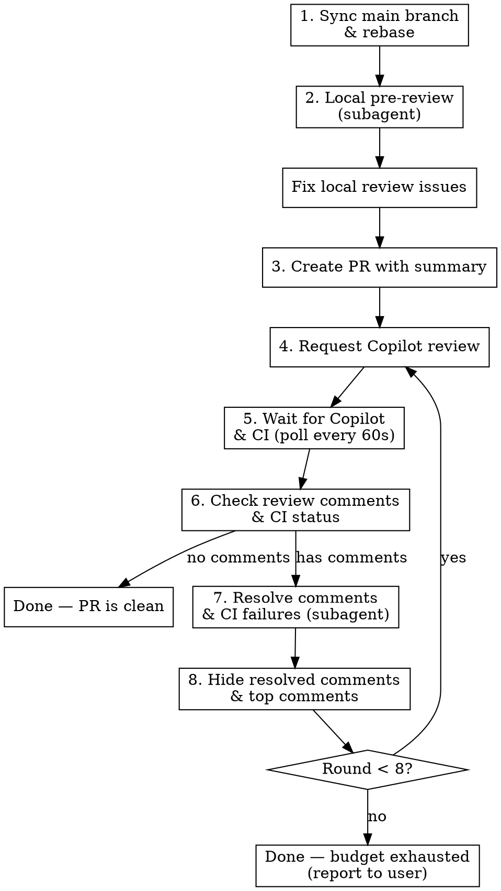

# Submitting PR with Copilot Review

## Overview

Automates the full PR submission lifecycle: local pre-review, PR creation with summary, and iterative Copilot review cycles until the PR is clean or the review budget is exhausted.

**Core principle:** Fix what you can locally first, then let Copilot catch what you missed, resolve its feedback automatically, and repeat.

## When to Use

- Submitting a PR to GitHub where Copilot is enabled as a reviewer
- Want automated review-fix-resolve cycles instead of manual back-and-forth

## Workflow



## Step 1: Sync Main Branch

Before anything else, sync with remote main to catch conflicts early:

```bash
# Update local main (works in worktrees too)
main_worktree=$(git worktree list | grep '\[main\]' | awk '{print $1}')
if [ -n "$main_worktree" ]; then
  git -C "$main_worktree" pull origin main
else
  git fetch origin main:main
fi

# Rebase current branch onto updated main
git rebase main
```

If rebase hits conflicts, resolve them before proceeding. After resolving, run the project's tests and lint checks to make sure nothing broke.

## Step 2: Local Pre-Review (Subagent)

Before creating the PR, dispatch a subagent to review the diff locally. This catches obvious issues without burning Copilot review cycles.

**Subagent prompt template:**

```
Review the diff between the current branch and main. Focus on:
- Bugs, logic errors, security issues
- Missing error handling
- Code style / lint issues the CI would catch
- Anything that would fail a code review

Run: git diff main...HEAD

For each issue found, fix it directly. After fixing, run the project's
format/lint checks to verify. Commit fixes as a separate commit.

Return: summary of issues found and fixed, or "no issues found".
```

After the subagent returns, verify its fixes compile and pass lint/tests.

## Step 3: Create PR with Summary

Generate a comprehensive PR summary from the commit history:

```bash
# Get base branch (usually main)
BASE_BRANCH=main

# Generate PR
gh pr create --base "$BASE_BRANCH" \
  --title "<concise title under 70 chars>" \
  --body "<full PR summary>"
```

**PR summary should include:**
- What changed and why (from commit messages + diff analysis)
- Key design decisions
- Testing done
- Breaking changes (if any)

## Step 4: Request Copilot Review

```bash
PR_NUMBER=$(gh pr view --json number -q '.number')
gh pr edit "$PR_NUMBER" --add-reviewer 'copilot-pull-request-reviewer[bot]'
```

## Step 5: Wait for Copilot Review and CI

Poll until both Copilot's review appears AND CI checks complete. Both typically take 5–10 minutes, so wait for them in the same loop.

```bash
# Poll every 60 seconds, timeout after 15 minutes
PREVIOUS_COUNT=0  # init before first round; update after each round
COPILOT_DONE=false
CI_DONE=false
for i in $(seq 1 15); do
  # Check Copilot review
  if [ "$COPILOT_DONE" = false ]; then
    REVIEW_COUNT=$(gh api repos/{owner}/{repo}/pulls/$PR_NUMBER/reviews \
      --jq '[.[] | select(.user.login == "copilot-pull-request-reviewer[bot]")] | length')
    if [ "$REVIEW_COUNT" -gt "$PREVIOUS_COUNT" ]; then
      echo "New Copilot review detected"
      PREVIOUS_COUNT=$REVIEW_COUNT
      COPILOT_DONE=true
    fi
  fi

  # Check CI status
  if [ "$CI_DONE" = false ]; then
    CI_STATUS=$(gh pr checks "$PR_NUMBER" --json state --jq '.[].state' 2>/dev/null | sort -u)
    if ! echo "$CI_STATUS" | grep -qE "PENDING|QUEUED|IN_PROGRESS"; then
      echo "CI checks completed"
      CI_DONE=true
    fi
  fi

  if [ "$COPILOT_DONE" = true ] && [ "$CI_DONE" = true ]; then
    break
  fi
  sleep 60
done
if [ "$COPILOT_DONE" = false ] || [ "$CI_DONE" = false ]; then
  echo "Timeout: Copilot=$COPILOT_DONE CI=$CI_DONE after 15 minutes"
fi
```

**IMPORTANT:** Track `PREVIOUS_COUNT` across rounds so you detect NEW reviews, not old ones. Update `PREVIOUS_COUNT=$REVIEW_COUNT` after each round's review is detected.

## Step 6: Check Review Comments

Replace `{OWNER}`, `{REPO}`, `{PR_NUMBER}` with actual values (e.g. from `gh repo view --json owner,name` and `gh pr view --json number`).

```bash
# Get unresolved Copilot review threads
# NOTE: GraphQL author.login = "copilot-pull-request-reviewer" (no [bot] suffix)
# REST API user.login = "copilot-pull-request-reviewer[bot]" (with [bot] suffix)
THREADS=$(gh api graphql -f query='
{
  repository(owner: "{OWNER}", name: "{REPO}") {
    pullRequest(number: {PR_NUMBER}) {
      reviewThreads(first: 100) {
        nodes {
          id
          isResolved
          comments(first: 1) {
            nodes {
              author { login }
              body
            }
          }
        }
      }
    }
  }
}' --jq '.data.repository.pullRequest.reviewThreads.nodes[]
  | select(.comments.nodes[0].author.login == "copilot-pull-request-reviewer")
  | select(.isResolved == false)')

# If no unresolved threads, PR is clean — done
if [ -z "$THREADS" ]; then
  echo "No unresolved comments — PR is clean"
  exit 0
fi
```

If CI is green AND either there are no unresolved comments or all comments are noise (no actionable fixes needed), the PR is clean. Report success and stop — no need to continue the loop.

If CI failed, check the failure logs and fix before proceeding:

```bash
# View failed checks
gh pr checks "$PR_NUMBER" --json name,state,link --jq '.[] | select(.state == "FAILURE")'
```

## Step 7: Resolve Comments and CI Failures (Subagent)

Dispatch a subagent to address both Copilot's feedback and CI failures in one pass. This keeps the main context clean.

**Subagent prompt template:**

```
Copilot left the following review comments on PR #{PR_NUMBER}.
For each comment, evaluate whether it's valid:

{PASTE COMMENT BODIES AND FILE LOCATIONS}

Additionally, the following CI checks failed:

{PASTE FAILED CHECK NAMES AND LOG SNIPPETS}

For valid Copilot issues:
- Fix the code
- Run format/lint checks
- Commit the fix

For CI failures:
- Read the failure logs, identify root cause, fix
- Re-run the project's test/lint/build commands locally to verify

For invalid/noise Copilot comments:
- Note why it's not applicable

Return: summary of what was fixed and what was skipped (with reasoning).
```

After the subagent returns, push the fixes:

```bash
git push
```

## Step 8: Hide Resolved Comments and Top Comments

Replace `{OWNER}`, `{REPO}`, `{PR_NUMBER}` with actual values. Note: GraphQL `author.login` omits the `[bot]` suffix — use `copilot-pull-request-reviewer` (not `copilot-pull-request-reviewer[bot]`).

```bash
# Resolve all unresolved Copilot review threads
gh api graphql -f query='
{
  repository(owner: "{OWNER}", name: "{REPO}") {
    pullRequest(number: {PR_NUMBER}) {
      reviewThreads(first: 100) {
        nodes {
          id
          isResolved
          comments(first: 1) {
            nodes { author { login } }
          }
        }
      }
    }
  }
}' --jq '
  .data.repository.pullRequest.reviewThreads.nodes[]
  | select(.comments.nodes[0].author.login == "copilot-pull-request-reviewer")
  | select(.isResolved == false)
  | .id' | while IFS= read -r tid; do
    gh api graphql \
      -F threadId="$tid" \
      -f query='mutation($threadId: ID!) {
        resolveReviewThread(input: {threadId: $threadId}) {
          thread { isResolved }
        }
      }'
done

# Hide (minimize) Copilot's top-level review comments
gh api graphql -f query='
{
  repository(owner: "{OWNER}", name: "{REPO}") {
    pullRequest(number: {PR_NUMBER}) {
      reviews(first: 50) {
        nodes {
          id
          author { login }
        }
      }
    }
  }
}' --jq '
  .data.repository.pullRequest.reviews.nodes[]
  | select(.author.login == "copilot-pull-request-reviewer")
  | .id' | while IFS= read -r rid; do
    gh api graphql \
      -F subjectId="$rid" \
      -f query='mutation($subjectId: ID!) {
        minimizeComment(input: {subjectId: $subjectId, classifier: RESOLVED}) {
          minimizedComment { isMinimized }
        }
      }'
done
```

## Step 9: Loop or Stop

Increment the round counter. If round < 8, go back to Step 4 (request Copilot review again).

If round >= 8, stop and report to the user:
- How many rounds were completed
- Whether comments remain unresolved
- Summary of what was fixed across all rounds

## Context Management

This workflow can consume significant context over multiple rounds. Mitigate by:

- **Using subagents** for Step 2 (local review) and Step 7 (resolve comments) — keeps review content out of main context
- **Compact between rounds** — after each resolve+hide cycle, the main agent only needs to track: round number, PR number, and previous review count
- **Don't read full diffs in main context** — delegate all diff reading to subagents

## Common Mistakes

- **Forgetting to track review count across rounds** — you'll re-process old reviews. Always compare against `PREVIOUS_COUNT`.
- **Not pushing after fixes** — Copilot reviews the remote branch, not local. Always `git push` before requesting re-review.
- **Fixing noise comments** — Copilot sometimes flags valid patterns as issues. The subagent should skip these with reasoning, not blindly fix everything.
- **Running out of context** — 8 rounds of review content adds up fast. Always use subagents for the heavy lifting.
